# Description de la création d'une button box (et retour d'expérience)

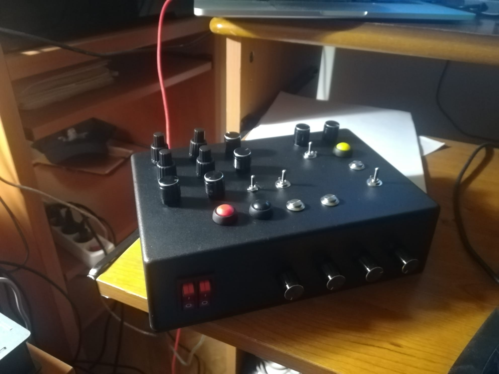
## Histoire

Au départ, le besoin : faire une *button box* pour faciliter l'usage des instruments dans **MSFS**, en particulier en VR. Le but est donc d'avoir des boutons qui tombent bien sous la main, pas de reproduire un panel spécifique pour un avion donné.

L'impulsion finale est venue d'une [vidéo youtube](https://www.youtube.com/watch?v=TOby1nIVuOA), qui porte sur un projet très différent (un cockpit relativement fidèle de Cessna).

L'un des intérêts de la vidéo en question est qu'elle donne une liste du matériel nécessaire, ce qui évite de chercher sans trop savoir que choisir.

Je pensais que ça me permettrait de faire une button box à moindres frais. En réalité, c'est plein de composants qui sont individuellement peu chers, mais mis bout à bout, ça douille sévère. Il faut dire que je me suis laissé entraîner pour le nombre de boutons.

## Les fournitures et le projet

On a besoin :

- d'une **carte** qui va porter la logique électronique du bouzin ;
- de divers boutons, encodeurs, potentiomètres (pas de potentiomètre dans mon cas) ;
- de cables (qui dépendent en partie du type de carte choisie) ;
- d'une boîte ou d'un support
- de matériel de soudure et de bricolage.

### Les boutons et autres

#### Les boutons simples

Les boutons simples se trouvent en de multiples versions, de plus ou moins bonne qualité. Compter en gros 10 euros pour 10 boutons.

Un bouton vous prendra un slot digital sur une carte.

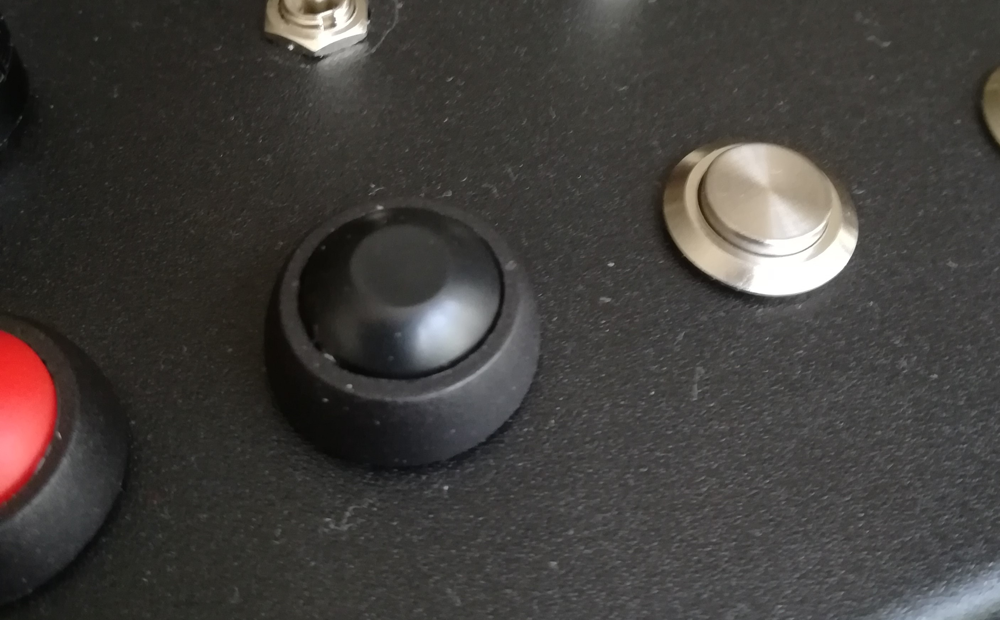

#### Les boutons à bascule

Se trouvent en plusieurs versions :

- des boutons momentanés, ils fonctionnent comme des boutons normaux ;
- des interrupteurs : au contraire des boutons momentanés, ils restent dans la position on ou off. Souvent mal gérés par les jeux - mais MSFS a récemment mis en place un système qui permet de prendre en compte le passage de ON à OFF et vice-versa. Avec un logiciel comme Joystick Gremlin, on peut donc simuler **deux** boutons avec un seul : une action est activée par le passage de ON à OFF, et l'autre par le passage de OFF à ON.
- avec une ou deux positions ON-(OFF)-ON. Les boutons à bascule momentanés à deux positions sont très bien pour contrôler par exemple des volets, ou un trim ; ils correspondent naturellement à deux boutons (sur la carte aussi!)

Un bouton à bascule vous prendra un ou deux slots digitaux sur une carte, selon les modèles.

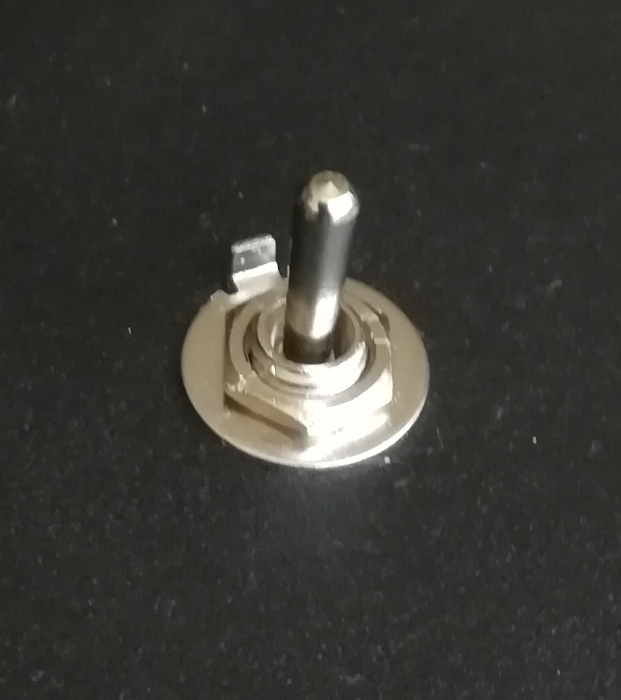

#### Les autres interrupteurs

On trouve par exemple des interrupteurs doubles rouges, parfaits pour l'activation de la batterie et de l'alternateur sur un avion d'aviation générale. 

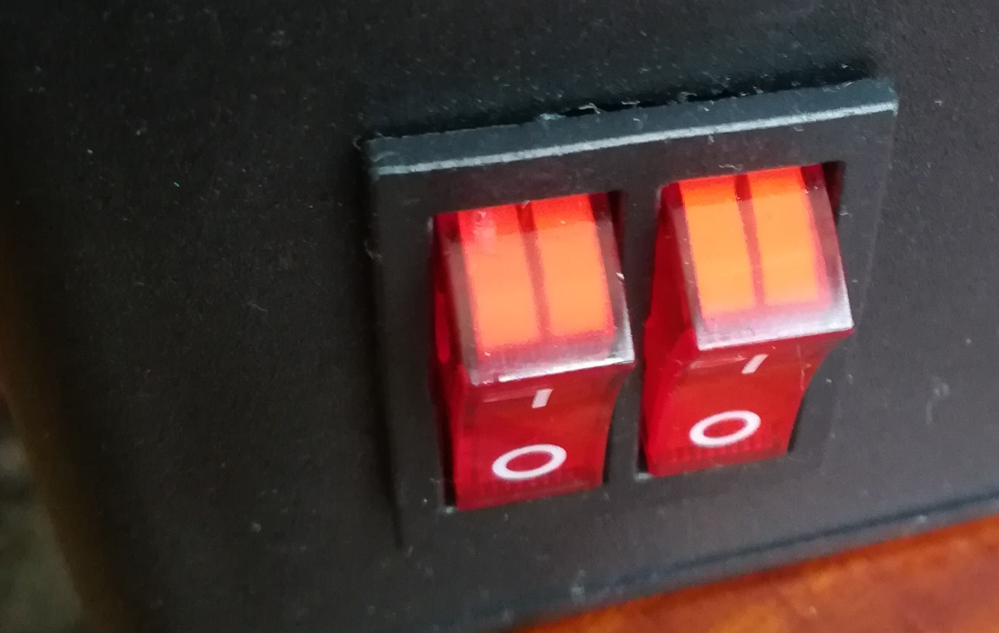

#### Les encodeurs

Ce sont des boutons qu'on peut tourner. Un encodeur fonctionne comme *deux* boutons, un bouton plus et un bouton moins, selon le sens de rotation. Une rotation correspond à un nombre variable de "clics" selon l'encodeur.
La plupart du temps, il est aussi possible d'enfoncer l'encodeur, ce qui donne un troisième bouton.

- Par rapport aux potentiomètres, ils sont plus souples : la plupart des simulateurs, quand une commande peut être liée à un axe, fournissent aussi une commande + et une commande -. D'autres commandes ne peuvent être liées qu'à des encodeurs (par exemple le réglage d'une radio COM ou NAV)
- Par rapport à des **boutons**, ils ont des avantages et des inconvénients. Si on prend une fonction comme un indicateur de cap, qu'on va avoir naturellement tendance à vouloir assigner à un encodeur, celui-ci ressemble à ce qu'on trouve dans l'avion. C'est donc plus naturel à utiliser. De plus, un déplacement de l'encodeur correspond à un degré ; c'est donc précis. En revanche, si l'encodeur fait 20 clics pour une rotation,  il faudra faire 9 tours complets pour faire 180° ; c'est beaucoup. On peut s'en sortir avec un logiciel comme Joystick Gremlin, en bidouillant pour que l'encodeur envoie plus de clics quand on le tourne *et* qu'on le presse. Avec des boutons, la plupart des simu considèrent que tant que le bouton est enfoncé, on augmente (ou on diminue) la valeur contrôlée. Les boutons à bascule à deux positions sont donc bien adaptés (d'ailleurs, c'est ce qu'il y a pour les trims dans pas mal d'avion).

Un encodeur vous prendra trois slots digitaux sur une carte (si on utilise la fonction "bouton enfoncé").

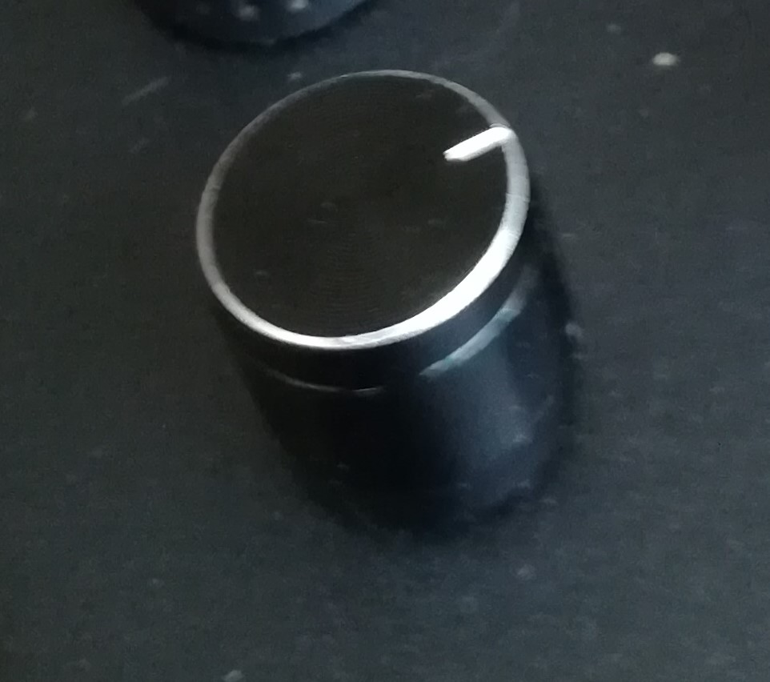

#### L'encodeur à deux axes concentriques

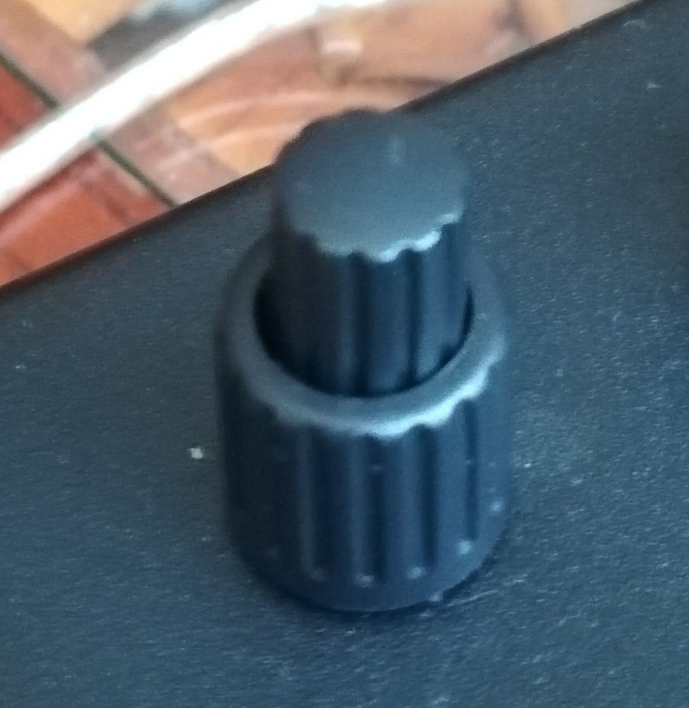

Ouf. Celui-là a été un gros poste de dépenses, et je me demande si c'était bien utile. 
C'est ce qu'on trouve pour régler par exemple COM et NAV dans un avion, avec deux molettes concentriques, 
une pour les valeurs entières et l'autres pour les fractions.

Il est beaucoup plus difficile à trouver que l'encodeur normal, beaucoup plus cher aussi. La version que j'ai prise a été un peu délicate à installer (physiquement et pas électroniquement).

Un encodeur à deux axes qu'on peut presser vous prendra cinq slots digitaux sur une carte.

La version de chez Ali Express qui est utilisée par *Poisson Volant* dans son cockpit n'a pas de pas de vis, ce qui demande de le fixer autrement, et il est très difficile de trouver des capuchons adaptés (on trouve des capuchons pour encodeurs de guitare électrique, mais ils ne conviennent pas vraiment). Bref, vous pouvez les utiliser si vous avez une imprimante 3D et que vous faites vos capuchons vous-même.

Bodnar propose des encodeurs, probablement de très bonne qualité, mais avec un prix à la hauteur.

J'ai finalement opté pour des encodeurs à 12$ l'unité avec capuchon, proposés par propwashsim, un site US. Sauf que si ça fait de base 44 euros au total, ce qui n'est pas négligeable, il faut aussi compter le transport et les taxes... et on arrive à 84 euros !

Le pas de vis étant assez court, ils n'on pas non plus été très simples à installer...

Si c'était à refaire, et dans le contexte d'une box pour la VR, je crois que je me passerais d'encodeurs doubles... Pour un cockpit non VR, ça reste tentant.

#### Les potentiomètres

Permettent d'avoir un axe qui renverra une valeur numérique, avec une position minimale et une position maximale.
Utile par exemple pour les volets de radiateurs. Demandent que la carte ait des sorties analogiques.

#### Les capuchons pour les boutons

Certains boutons ne sont pas fournis avec des capuchons (surtout les encodeurs et les potentiomètres). Je n'ai pas bien vu d'endroits où en acheter ; avec une imprimante 3D, on doit pouvoir faire des trucs sympas.

### Le choix de la carte

On a trois grandes possibilités :

- une [carte joystick](https://www.amazon.fr/Easyeeasy-Bricolage-Joystick-Contr%C3%B4le-Terminal/dp/B095LMBQQ2/ref=sr_1_3?__mk_fr_FR=%C3%85M%C3%85%C5%BD%C3%95%C3%91&crid=ZZ24GITPFX3K&keywords=carte+joystick&qid=1648662080&sprefix=carte+joystick%2Caps%2C58&sr=8-3) ; on en trouve plein sur Amazon - ça n'est pas très cher. Ça gère un nombre restreint de boutons, et un joystick. Il serait intéressant de voir si on peut remplacer le joystick par des potentiomètres ;
- une **carte arduino**, de préférence une **Leonardo** ou  **micro** (pas une Uno). Si le système est **uniquement** dédié à MSFS, alors une Uno est probablement envisageable, car il me semble qu'il y a une bibliothèque qui parle directement à MSFS. Sinon, la  **Leonardo**  et la  **micro** utilisent la puce **ATmega32u4** qui peut se faire passer pour un contrôleur de jeu USB auprès de Windows. L'arduino est extensible, et programmable, ce qui permet potentiellement d'avoir plus d'interactions (par exemple des LEDS train sorti/rentré, ce genre de choses). Une Leonardo de base a 5 sorties analogiques, et 13 sorties digitales, soit 5 axes et 13 boutons sans se fatiguer. On peut avoir plus de boutons, soit en utilisant la technique de la "grille" de boutons, soit en utilisant une carte d'extension (à vérifier). Si on veut mettre des encodeurs à la place des boutons, le système de grille n'est pas forcément utilisable (à vérifier aussi). Les arduino sont un peu plus chères que les cartes joystick (ça dépend aussi si on prend une "vraie" arduino ou un clone ; on trouve des Leonardo à 20€ et des clones pour beaucoup moins, reste à savoir s'ils fonctionnent).
- une carte Leo Bodnar ; simple et étudiée pour. Plusieurs modèles :
    - la carte 32 boutons, qui permet d'avoir des boutons ou des encodeurs ;
    - la carte "joystick", qui permet d'avoir jusqu'à 32 boutons, mais aussi des axes numériques (et donc des potentiomètres)
    - la carte 64 boutons, qui permet d'avoir jusqu'à 64 boutons ou 32 encodeurs.

    Les cartes Leo Bodnar sont assez chères de base, mais avec le Brexit en plus, ça ajoute des taxes et un coût de transport pas négligeable. Ayant le choix entre la 32 boutons à 33£50 et la 64 boutons à 38£50, je me suis laissé tenté par cette dernière (ce qui m'a aussi conduit... à tout utiliser). Mais au total, ça m'est revenu à 48€ plus 17€ de douane. Noter que certaines cartes sont disponibles avec plusieurs systèmes de branchement. La 64 boutons est moins perfectionnée que la 32 boutons, elle utilise des prises dupont femelles.

### Le boîtier

Les solutions possibles sont :

- un boîtier en plastique (typiquement *boitiers de jonctions*), à la bonne taille. Se creusent assez facilement pour faire passer les boutons ;
- un boîtier maison, avec une armature  et un panneau en bois ;
- un boîtier maison, avec une armature en bois, et un panneau en acrylique. Le site de [sculpteo](https://www.sculpteo.com/fr/) propose des panneaux avec découpe laser. Il suffit de dessiner le panneau dans Inkscape. Le prix m'a l'air raisonnable (une quinzaines d'euros). Mais évidemment, si on a accès par ailleurs à ce matériel, ça peut devenir intéressant.

## Ma Boîte

J'ai pas mal tâtonné. Je donne ici les coûts de ce que j'ai **vraiment** utilisé. Aller, non, à moment donné j'ai acheté une boîte pour surgelés au marché à 1€50 pour faire un boîtier temporaire et faire des essais? Ce qui m'a entraîné à faire des trous.

### Les composants

Plusieurs des liens viennent du travail de [Poisson Volant sur YouTube](https://www.youtube.com/watch?v=TOby1nIVuOA)

- [un Boîtier en ABS](https://www.amazon.fr/gp/product/B07NVK538F/ref=ppx_yo_dt_b_asin_title_o00_s00?ie=UTF8&psc=1) : 17.92
- [Câbles avec prises dupont femelles](https://www.amazon.fr/gp/product/B07KFNX6HW/ref=ppx_yo_dt_b_asin_title_o01_s00?ie=UTF8&th=1)	10
- [Boutons métal (les 10)](https://www.amazon.fr/gp/product/B0811QKG1R/ref=ppx_yo_dt_b_asin_title_o01_s00?ie=UTF8&psc=1)9.49
- [Boutons plastique (les 12)](https://www.amazon.fr/gp/product/B07Q73PXYL/ref=ppx_yo_dt_b_asin_title_o05_s00?ie=UTF8&psc=1)	9.99
- [bascules (on)-off-(on) (les 5)](https://www.amazon.fr/gp/product/B07H5NX4G9/ref=ppx_yo_dt_b_asin_title_o00_s00?ie=UTF8&psc=1)	8.89
- [10 encodeurs rotatifs](https://www.amazon.fr/gp/product/B08728PS6N/ref=ppx_yo_dt_b_asin_title_o05_s00?ie=UTF8&psc=1)	25.98 (13 euros les 5)
- [Carte Léo Bodnar plus douane et transport](http://www.leobodnar.com/shop/index.php?main_page=product_info&cPath=94&products_id=300) 65	
- [Encodeurs doubles (x4) avec douane et transport](https://www.propwashsim.com/store/dual-encoder-kit)	83.83
- [Interrupteur à bascule, deux boutons rouges](https://fr.aliexpress.com/item/1005003098591027.html?gatewayAdapt=glo2fra&spm=a2g0o.order_detail.0.0.61357d566luDWK)	2

Bon, du coup, ça nous amène à un dépassement de budget digne d'un EPR. Je pensais être dans les 100€. On en est à 233€, sans compter le matériel.

### Le matériel

Tout n'est pas forcément listé ; pour le fer à souder, on doit pouvoir faire mieux.

- [kit de soudure](https://www.amazon.fr/gp/product/B07PLTB46N/ref=ppx_yo_dt_b_asin_title_o04_s00?ie=UTF8&psc=1)	30.99
- [Troisième main](https://www.pearl.fr/article/NX5373/troisieme-main-avec-pinces-de-serrage-loupe-a-led-et-support-pour-fer-a-souder)	17
- [Fil de soudure](https://letmeknow.fr/fr/soudure/394-adafruit-bobine-d-etain-plomb-05mm-50g-0701851959744.html)	7.2
- [Nettoyeur de panne](https://letmeknow.fr/fr/soudure/1122-nettoyeur-de-panne-191466033791.html)	6
- [Gaines thermo rétractables](https://www.pearl.fr/article/NX3880/coffret-de-gaines-thermoretractables-128-pieces)	6
- [Forets étagés](https://www.pearl.fr/article/KT2959/3-forets-etages-hss)	20
		
Total		87.19

J'ai par ailleurs utilisé ma perceuse, diverses pinces et tournevis, mais je ne les compte pas. On peut éventuellement se passer de troisième main et peut-être aussi de fil termo-rétractable.
		
Si on trouve à emprunter le tout, on peut s'en tirer pour moins, évidemment.

## La fabrication

Première étape, dessiner à l'échelle le placement des boutons sur [Inkscape](https://inkscape.org/fr/). On peut aussi utiliser une bête feuille de papier. Les trous à prévoir sont de 8mm de diamètre pour les encodeurs et bascules, et 12mm pour les boutons.

À propos des cables : tout dépend de la carte que vous avez, les fixations changent d'une carte à l'autre.

- dans mon cas, la carte Bodnar pour 64 boutons a des fiches adaptées à des connecteur dupont femelles ; j'ai donc utilisé des cables déjà dotés de fiches ;
- je coupe les cables pour ne garder qu'un côté avec les prises dupont (que je fixerai à la carte Bodnar) ;
- je choisi les couleurs à utiliser pour les cables reliés à chaque composants, pour ne pas me tromper lors des branchements ;
- je dénude l'autre extrémité, et je la soude au bouton, encodeur, etc... Attention, les fumées sont toxique, j'avais ouvert ma fenêtre et mis un ventilateur pour expulser l'air vers l'extérieur.
- je fixe le tout en respectant les règles des cartes Bodnar (un encodeur prend deux positions, en commençant forcément par une position impaire). Toujours chez Bodnar, la terre se met à l'extérieur.

En fait, j'ai d'abord fait quelques tests de boutons et d'encodeurs isolés. Je n'ai tout fixé qu'au moment de l'installation dans la boîte.

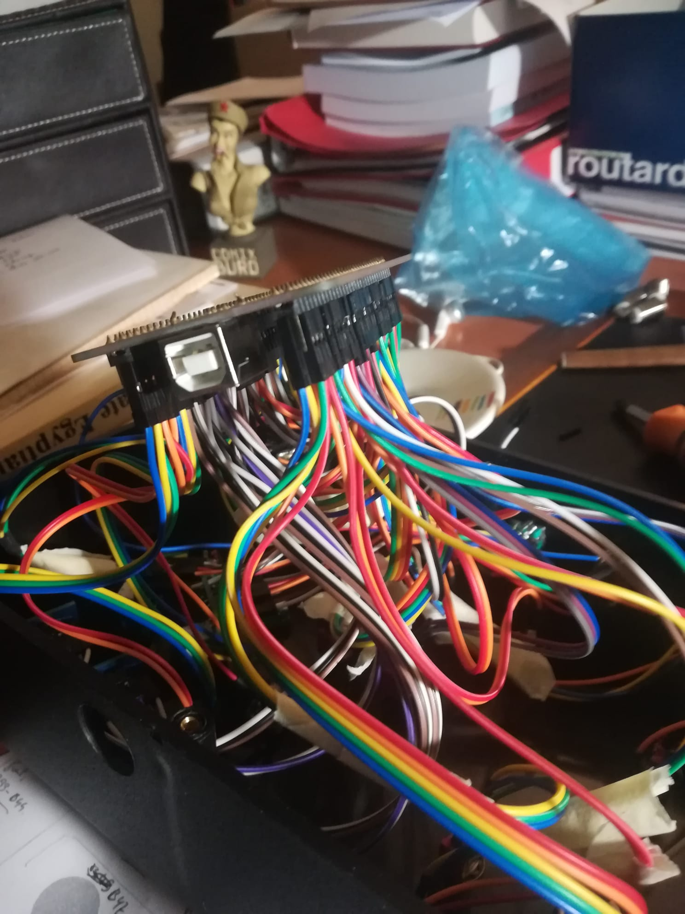

### Les trous dans le boîtier

J'ai fait une première maquette avec une boîte pour aliments achetée au marché.

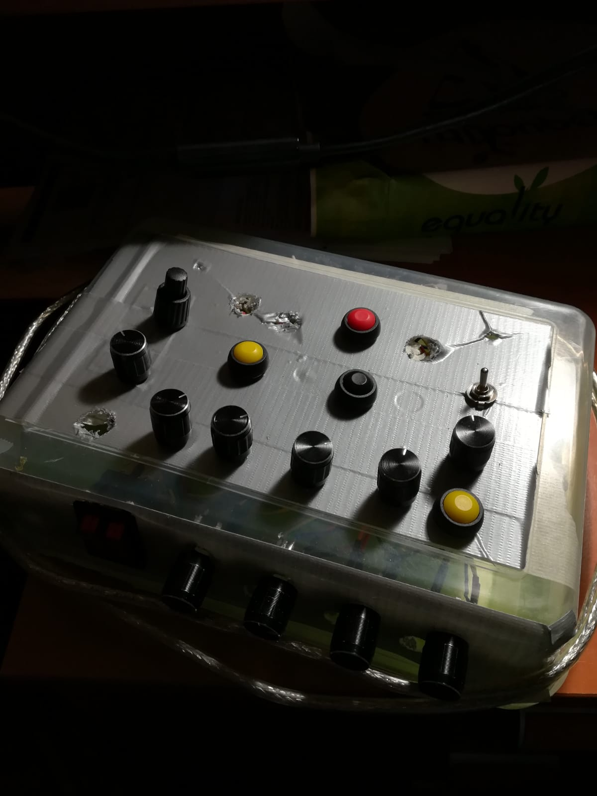

Ensuite, je suis passé aux choses sérieuses.

J'ai d'abord collé de l'adhésif protecteur (par exemple celui qu'on utilise en peinture) pour éviter que le boîtier ne s'écaille. 

Pour chaque trou, j'ai fait une amorce avec un forêt fin de la perceuse, en prenant mon temps, par petites touches.

Ensuite, j'ai utilisé le forêt étagé (sur la perceuse), en descendant jusqu'au niveau requis.

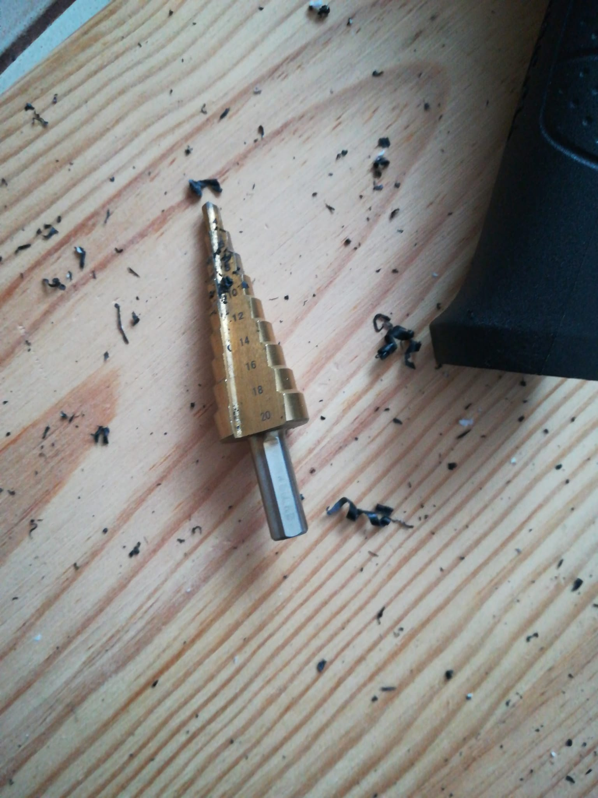

Suggestion : si on s'arrête un peu avant d'atteindre le diamètre attendu, ce qui me semble prudent, on peut faire les finition en tournant le forêt à la main. Le plastique n'est pas très difficile à creuser.

Pour le gros interrupteur, j'ai plus ou moins utilisé la technique présentée par [Poisson Volant](https://www.youtube.com/watch?v=n5P_7Le8mQg) dans sa première vidéo : percer aux angles du rectangle à éviter, puis régulièrement sur le pourtour (plutôt vers l'intérieur, évidemment). J'ai terminé en limant à la main jusqu'à ce que le composant rentre.

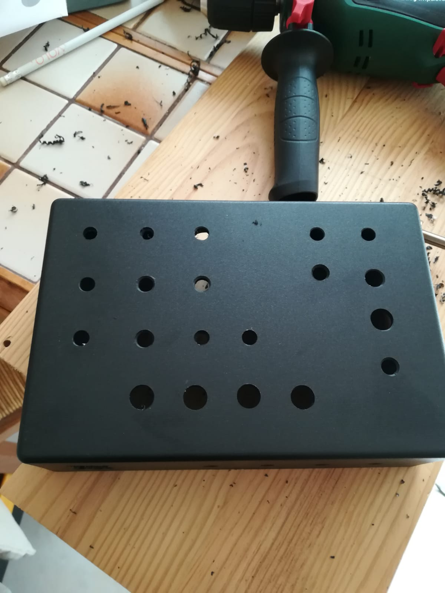
Voilà, plus qu'à refermer...

## Le travail avec Joystick Gremlin

Comme j'ai des périphériques de plusieurs origines, au lieu d'utiliser leurs logiciels dédiés d'origine, je passe par Joystick Gremlin, un shareware qui fonctionne très bien. Il se combine avec vjoy (qui crée des "joysticks virtuels"). En l'occurrence, ici, ça me permet de mapper un mode "rapide" pour les encodeurs quand l'encodeur est enfoncé.

Le système actuel est le suivant :

J'ai défini avec vjoy un joystick virtuel, qui sera vu par MSFS ; les actions de ce joystick 
sont déclenchées par Joystick Gremlin.

Pour la rotation d'un des encodeur, mettons vers la gauche, le bouton correspondant est le bouton 27 ; le bouton 28 correspond au sens vers la droite, et le bouton 29 est activé quand on presse l'encodeur.

Je vais donc associer deux actions différentes au bouton 27, selon que le bouton 29 est enfoncé ou non.

Pour qu'il n'y ait pas de confusion, ces actions seront des actions du joystick virtuel 1 (on pourrait aussi envoyer des codes de touches du clavier). Pour ne pas m'embêter avec les numéros :

- quand on tourne sans enfoncer, ça enverra comme information une pression du bouton 27 du joystick virtuel 1 (donc je précise qu'une pression du bouton 27 de ma boîte correspond au bouton 27 du joystick virtuel) ;
- quand on tourne en pressant l'encodeur, j'utilise une **macro** qui permet d'envoyer des **séquences** d'actions plus précises. On aurait pu envoyer une série plusieurs actions du bouton virtuel 27 (5 clics pour 1 clic par exemple), mais pour l'instant j'ai préféré envoyer l'action "presser le bouton virtuel 27", sans ajouter l'action "relâcher le bouton 27". Tout se passe alors comme si je maintenait ce bouton enfoncé. Pour le relâcher, il suffit de tourner une fois de plus le bouton, mais sans l'enfoncer. C'est un peu curieux comme ergonomie, mais assez pratique en fin de compte. Une première capture d'écran montre 
comment c'est configuré dans Joystick Gremlin. La seconde capture d'écran montre comment on associe les deux possibilités au fait que le bouton 29 soit ou non enfoncé.

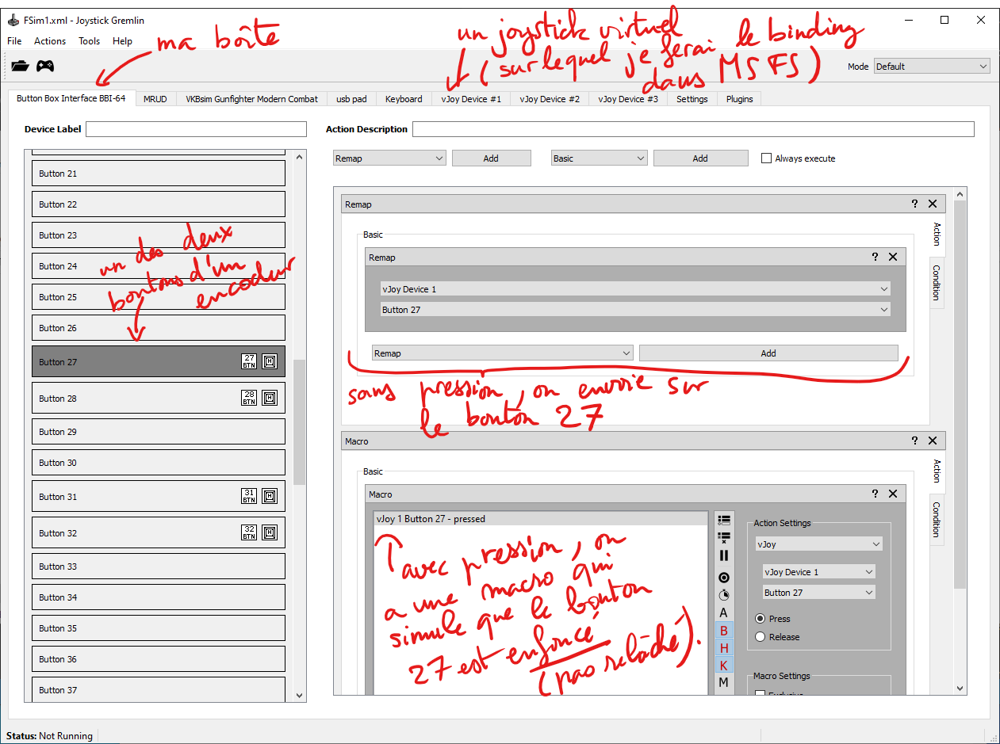

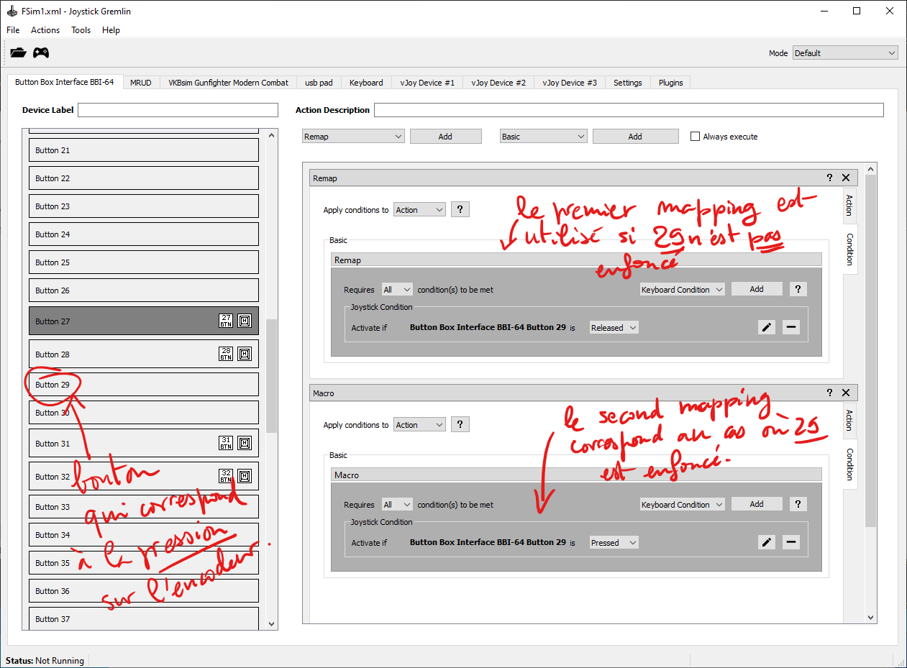

## Conclusions

Ça n'est pas bon marché, mais j'ai eu la folie des grandeurs. En reprenant les composants, se faire un boitier avec quelques potentiomètres et une dizaine de boutons ça reviendrait à :

- une arduino 20€
- 10 euros de cables
- un boitier à 17 euros (ou moins, il peut être plus petit du coup)
- 10 euros de boutons plastiques
- 10 euros de potentiomètres (approximatif, et je n'ai pas regardé les diverses qualités)

Donc dans les 70€, sans l'outillage, pour une version minimaliste à base d'arduino. Moins si on part sur une carte joystick-de-chez-amazon.

Attention aussi à ne pas trop tasser les boutons, histoire de les différencier facilement.

A moment donné, j'ai déconnecté les fonctions boutons sur deux de mes encodeurs, pour avoir deux boutons "normaux" supplémentaires. C'était une erreur, car la fonction d'avance rapide est quand même très très pratique. Je vais probablement sacrifier l'un des quelques boutons que j'ai ajouté "parce que c'était possible et qu'il faut pas gâcher", en essayant de placer quelque chose qui masque le trou (autre option: en débranchant ce bouton là), et de re-cabler mes deux encodeurs. J'ai bêtement coupé les fils que j'avais soudés et que je n'utilisait plus :-(.
